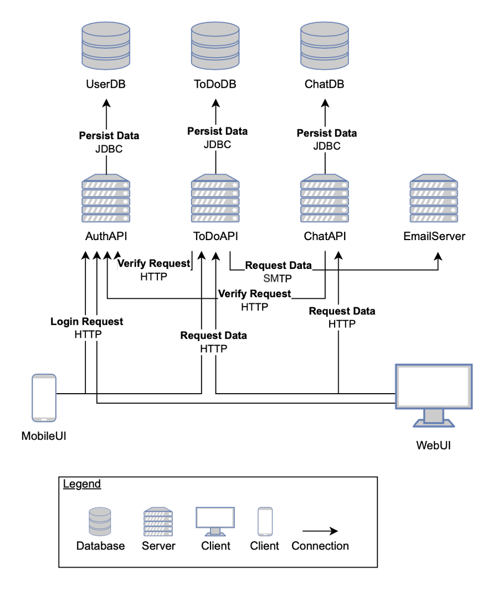
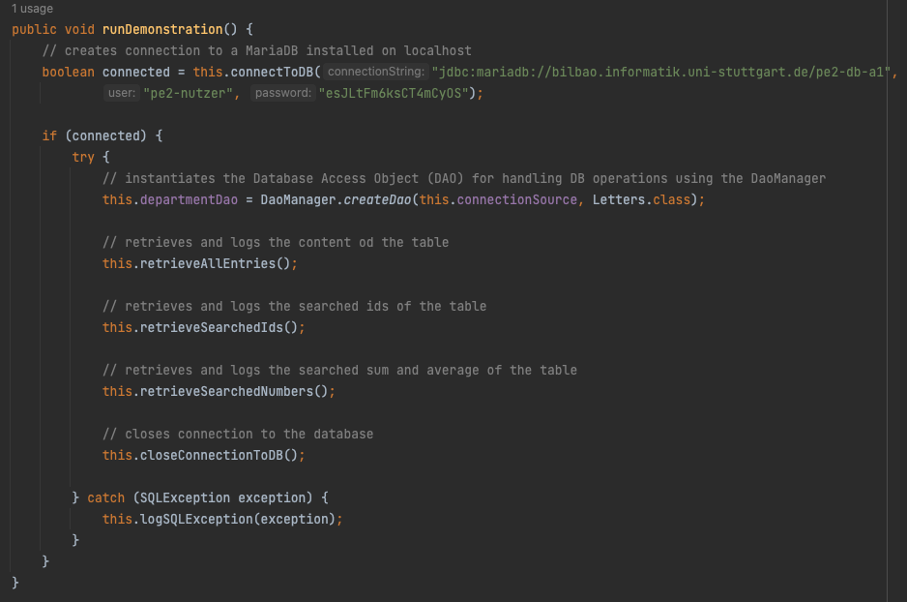
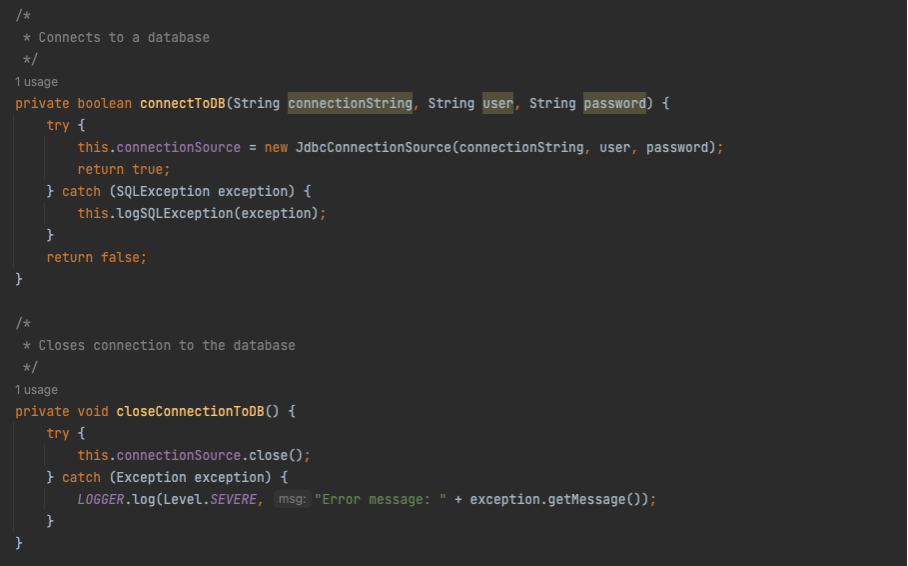
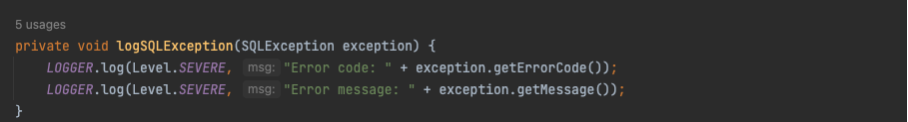
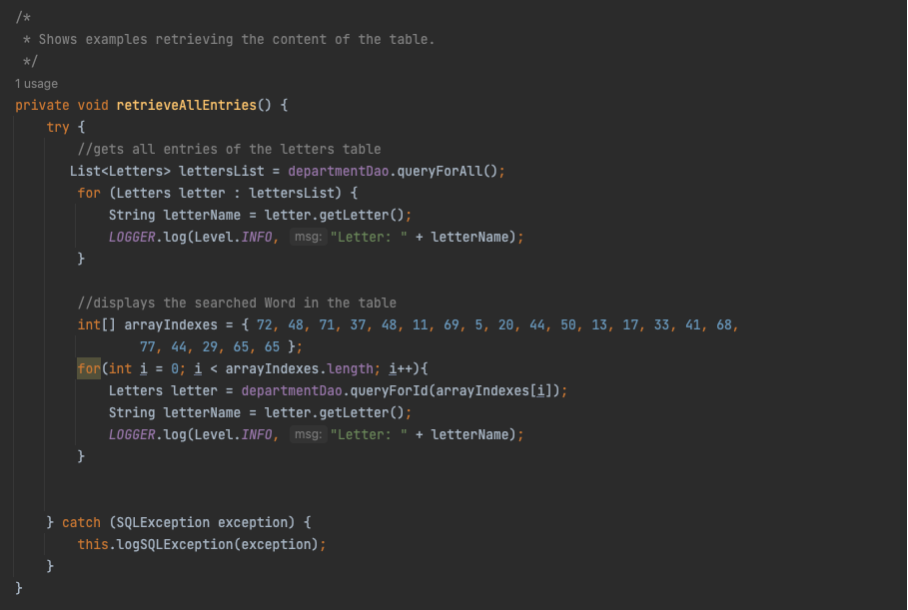
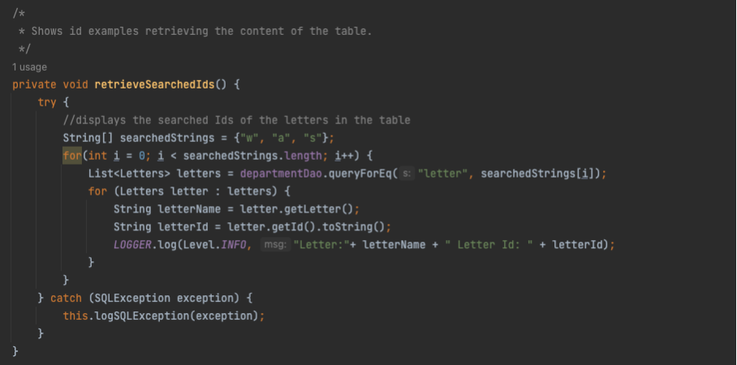
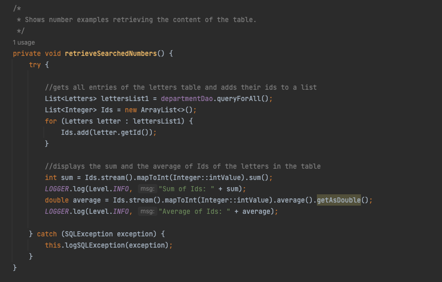

*** 
Marie Kufner <st173710@stud.uni-stuttgart.de>

Matrikelnummer: 3535116 

Git Repo: [repo47](https://sopra.informatik.uni-stuttgart.de/pe2-ws22/repo047.git) 

Programmentwicklung 2 
***

# Aufgabenblatt 01

## Aufgabe 1: Architektur 




## Aufgabe 2: SQL und JDBC 


### Aufgabe 2.1 Werkzeugunterstützte SQL-Befehle 
------------------------------------------------

a) 

**CREATE TABLE IF NOT EXISTS** todos(  
id **INTEGER PRIMARY KEY**,   
title **VARCHAR(100) NOT NULL CHECK** (title <>””) **DEFAULT** 'New todo',   
description **VARCHAR**(500) . 
);

b) 

**INSERT INTO** todos   
(id, title, description) **VALUES**   
(1, 'Einen SQL-Befehl zur Erstellung einer Datenbanktabelle entwerfen', 'Die Tabelle hat drei Spalten (id, title, description); id ist eine Zahl und ist der Primaerschluessel; title und description sind Zeichenfolgen mit maximaler Laenge von 100 und 500; title darf nicht null oder leer sein; Wenn der Tabelle eine neue Zeile zugef¸gt wird und f¸r title kein Wert angegeben wurde, erh‰lt diese Zeile "New todo" als Standardwert.');

c) 

**SELECT** title  
**FROM** todos  
**WHERE** title **LIKE** '%TodoAPI%'  
**OR** description **LIKE** '%TodoAPI%';  

**Ausgabe:**  
- Weitere Todos für die TodoAPI! eintragen    
- Die Attribute eines Todo-Objekts für die TodoAPI definieren 
- Die Geschaeftslogik fuer die TodoAPI entwerfen   


### Aufgabe 2.2 Programmatische Datenbankabfrage
------------------------------------------------
Folgende Methoden sind für alle drei Teilaufgaben relevant:   




a) 

Das gesuchte Wort ist: **„PrOgrAMMEntwickLUnGII“**



b) 

IDs für **'W' = 13, 53, 79**  
IDs für **'a' = 3, 11, 18, 31, 57**  
IDs für **'s' = 49, 75**  



c) 

Summe = **3766**  
Durchschnittswert = **46.49382716049383**   



## Aufgabe 3: HTTP und REST  


a) 

GET https://api.chucknorris.io/jokes/random?category=science

```
"categories": [     
        "science"   
    ],    
    "created_at": "2020-01-05 13:42:19.576875",    
    "icon_url": "https://assets.chucknorris.host/img/avatar/chuck-norris.png",    
    "id": "_4ci8ue3rkenn5tq9lameq",    
    "updated_at": "2020-01-05 13:42:19.576875",    
    "url": "https://api.chucknorris.io/jokes/_4ci8ue3rkenn5tq9lameq",    
    "value": "It is believed dinosaurs are extinct due to a giant meteor. That's true if you want to call Chuck Norris a giant meteor."
}
```

b) 

POST https://postman-echo.com/post 

```
{
    "args": {},
    "data": {
        "key": "pe2ws22",
        "purpose": "This is a test."
    },
    "files": {},
    "form": {},
    "headers": {
        "x-forwarded-proto": "https",
        "x-forwarded-port": "443",
        "host": "postman-echo.com",
        "x-amzn-trace-id": "Root=1-637272b5-0c0656f82f0e67b866b30df4",
        "content-length": "52",
        "content-type": "application/json",
        "user-agent": "PostmanRuntime/7.29.2",
        "accept": "*/*",
        "postman-token": "d20c009d-f1c4-4b19-b8e3-65de29deb20d",
        "accept-encoding": "gzip, deflate, br",
        "cookie": "sails.sid=s%3Ay9ypVsZT81i6wFRbiizD9d1wvO6xMoJx.nQOijtf9gW%2FykVTfb1YG6lT9XRB3vN9%2F6RItpzDCFzk"
    },
    "json": {
        "key": "pe2ws22",
        "purpose": "This is a test."
    },
    "url": "https://postman-echo.com/post"
}

```

c)

- Alle Computer-Spiele abrufen:  	
&nbsp; **GET**  &nbsp;&nbsp; /games 
- Alle Computer-Spiele abrufen gefiltert nach Kategorie, Titel und Altersbeschränkung [*](#*Anmerkung:-Orientierung-der-Schreibweise-an-Chucknorris-API):   
&nbsp;**GET**  &nbsp;&nbsp;/games?category={category}&title={title}&ageRestriction=true
- Ein einziges Computer-Spiel anzeigen lassen: &nbsp; **GET**  &nbsp;&nbsp; /games/$id 
- Ein neues Computer-Spiel anlegen: 	
&nbsp; **POST**  &nbsp;&nbsp;/games 
- Ein einziges Computer-Spiel updaten: 
&nbsp;&nbsp; **UPDATE**  &nbsp;	/games/$id 
- Ein einziges Computer-Spiel löschen: 
&nbsp;&nbsp; **DELETE**  &nbsp; 	/games/$id 	<br><br>


##### *Anmerkung: Orientierung der Schreibweise an Chucknorris API 
